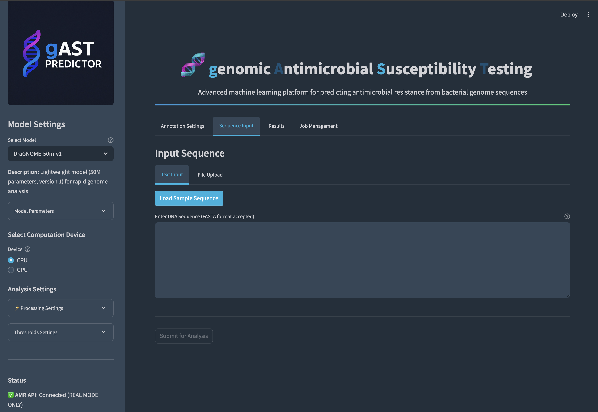

# AMR Predictor - Antimicrobial Resistance Prediction Tool

## Overview
The AMR Predictor is a bioinformatics tool that leverages fine-tuned nucleotide transformer models to predict antimicrobial resistance (AMR) from genomic sequences. It combines state-of-the-art deep learning with practical bioinformatics workflows.



## Key Features
- **Nucleotide Transformer Integration**: Uses fine-tuned transformer models (default: [DraGNOME-2.5b-v1](https://huggingface.co/alakob/DraGNOME-2.5b-v1)) for sequence analysis
- **Bakta Integration**: Automated genome annotation through Bakta API
- **Sequence Processing**: Handles long sequences through intelligent segmentation
- **Multi-Environment Support**: Separate configurations for dev, test, and prod environments
- **Streamlit Interface**: User-friendly web interface for analysis
- **REST API**: Programmatic access to prediction capabilities

## Technical Stack
- **Backend**: Python/FastAPI
- **Frontend**: Streamlit
- **Database**: PostgreSQL
- **Model**: Fine-tuned Nucleotide Transformer
- **Containerization**: Docker/Docker Compose

## Architecture Overview

The application follows a containerized, API-driven architecture with distinct frontend and backend components.

```mermaid
graph TD
    subgraph User_Interaction
        User[<fa:fa-user> User]
    end

    subgraph Frontend_Streamlit
        direction LR
        UI[<fa:fa-desktop> Streamlit UI - app.py]
        Utils[<fa:fa-cogs> Streamlit Utils - utils.py]
        State[<fa:fa-database> Session State]

        UI -- Manages --> State
        UI -- Uses --> Utils
        Utils -- Updates --> State
    end

    subgraph Backend_FastAPI
        direction LR
        API[<fa:fa-server> AMR FastAPI - main.py_routers]
        AMRModel[<fa:fa-brain> AMR Prediction Model]
        BaktaClient[<fa:fa-plug> Bakta Client_Executor]
        DBClient[<fa:fa-database> Database Client - SQLAlchemy_asyncpg]
        Auth[<fa:fa-shield-alt> Auth_Potential]

        API -- Uses --> DBClient
        API -- Runs --> AMRModel
        API -- Communicates via --> BaktaClient
        API -- Potentially Uses --> Auth
    end

    subgraph Database_PostgreSQL
        DB[<fa:fa-database> PostgreSQL Database - amr_predictor_dev]
        SchemaInit[<fa:fa-file-code> Schema Init Scripts]
    end

    subgraph External_Services
        BaktaSvc[<fa:fa-cloud> Bakta Service_API]
    end

    subgraph Infrastructure_Deployment_Docker
        direction TB
        BuildScript[<fa:fa-terminal> build_container.sh] -- Manages --> DockerEnv
        subgraph Docker_Environment
            direction LR
            StContainer[<fa:fa-docker> Streamlit Container]
            ApiContainer[<fa:fa-docker> API Container]
            DbContainer[<fa:fa-docker> DB Container]
            PgAdmin[<fa:fa-docker> pgAdmin Container]
        end
        DockerVolumes[<fa:fa-hdd> Docker Volumes - DB_Data_Results]

        BuildScript -- Initializes --> DbContainer
        SchemaInit -- Used by --> BuildScript
        DbContainer -- Uses --> DockerVolumes
        PgAdmin -- Accesses --> DbContainer
        StContainer -- Runs --> UI
        ApiContainer -- Runs --> API
    end

    subgraph Logging_Monitoring
        Logging[<fa:fa-clipboard-list> Logging - Python Logger]
    end

    %% Interactions & Data Flow
    User -- Interacts - Input Sequence_Settings --> UI
    UI -- Submits Job Request - FASTA_Params --> API
    UI -- Polls for Status - Job ID --> API
    UI -- Fetches Results - Job ID --> API
    API -- Returns Status_Results --> UI

    API -- Stores_Retrieves Job Info - Job ID_Status_Params_Sequence --> DBClient
    API -- Stores_Retrieves Results - Predictions_Annotations --> DBClient
    DBClient -- Interacts --> DB

    API -- Sends Sequence --> AMRModel
    AMRModel -- Returns Predictions --> API

    API -- Submits Bakta Job - Sequence_Config_Secret --> BaktaClient
    BaktaClient -- Interacts --> BaktaSvc
    BaktaSvc -- Returns Job ID_Status_Results --> BaktaClient
    BaktaClient -- Relays Status_Results --> API

    Auth -- Secures --> API
    UI -- Auth Request --> Auth

    UI -- Logs Events --> Logging
    API -- Logs Events --> Logging

    %% Styling (Optional)
    classDef frontend fill:#f9f,stroke:#333,stroke-width:2px;
    classDef backend fill:#ccf,stroke:#333,stroke-width:2px;
    classDef database fill:#cfc,stroke:#333,stroke-width:2px;
    classDef external fill:#fca,stroke:#333,stroke-width:2px;
    classDef infra fill:#eee,stroke:#333,stroke-width:2px;
    classDef user fill:#add,stroke:#333,stroke-width:2px;
    classDef logging fill:#fff,stroke:#999,stroke-width:1px,stroke-dasharray: 5 5;

    class User user;
    class UI,Utils,State frontend;
    class API,AMRModel,BaktaClient,DBClient,Auth backend;
    class DB,SchemaInit database;
    class BaktaSvc external;
    class BuildScript,StContainer,ApiContainer,DbContainer,PgAdmin,DockerVolumes infra;
    class Logging logging;
```



For a detailed explanation of each component and their interactions, please see the [Architecture Explanation](./docs/architecture_explanation.md) document.

## Models
The application uses fine-tuned nucleotide transformer models available on Hugging Face:

- **Primary Model**: [DraGNOME-2.5b-v1](https://huggingface.co/alakob/DraGNOME-2.5b-v1)
  - 2.5 billion parameter model
  - Fine-tuned for AMR prediction
  - Optimized for genomic sequence analysis

- **Alternative Models**:
  - [DraPLASMID-2.5b-v1](https://huggingface.co/alakob/DraPLASMID-2.5b-v1) - Specialized for plasmid analysis
  - [DraGNOME-50m-v2](https://huggingface.co/alakob/DraGNOME-50m-v2) - Lightweight version for faster inference

## Database Schema
The application uses tables for storing AMR job details, Bakta annotation data, user information, and related metadata. Key tables include `amr_jobs`, `bakta_jobs`, `amr_job_parameters`, `bakta_annotations`, and `users`. See the initialization scripts in `docker/postgres/init/` for full details.

## Setup and Installation
1. Clone the repository
2. Configure environment variables in `.env` (if necessary)
3. Run `./build_container.sh` to build and start all services (this handles dependencies and initialization order).

### Container Management
The application provides a primary script for container management:

- `build_container.sh`: Stops existing services, cleans up volumes, rebuilds all containers, starts them in the correct order (PostgreSQL first), verifies the database schema, and tails the logs. Use this script for a full environment rebuild.
  ```bash
  ./build_container.sh
  ```

## Usage
- **Web Interface**: Access the Streamlit interface at `http://localhost:8501`
- **API**: Use the REST API at `http://localhost:8000` (Explore endpoints via `http://localhost:8000/docs`)

## Development
- **Environment Management**: Use `build_container.sh` for a clean development environment setup.
- **Database Schema**: Modify scripts in `docker/postgres/init/` and run `build_container.sh` to apply changes.
- **Testing**: Ensure tests cover interactions between components as outlined in the architecture.

## Performance Considerations
- Batch processing for large sequences is handled via the API/backend logic.
- GPU acceleration for the model can be configured in the environment.
- Sequence segmentation logic exists for handling long genomes effectively.
- Caching strategies might be employed in the API or database layers for optimization.

## Contributing
1. Follow the development guidelines in the repository.
2. Use the provided Docker setup via `build_container.sh` for consistency.
3. Ensure changes align with the established architecture and data flow.

## License
[Specify license information]

## Support
[Add support contact information]