# AMR Predictor Application Architecture

Below is a comprehensive diagram representing the architecture of the AMR Predictor application:

```mermaid
graph TB
    subgraph "Client Layer"
        CLI["CLI Interface"]
        WebUI["Web Interface"]
        API_Client["API Client"]
        WebSocket["WebSocket Client"]
    end

    subgraph "API Layer"
        API["FastAPI App"]
        Routes["API Routes"]
        WS_Handler["WebSocket Handler"]
        Middleware["Middleware"]
        ErrorHandlers["Error Handlers"]
    end

    subgraph "Service Layer"
        JobManager["Job Manager"]
        BatchManager["Batch Manager"]
        AnalysisService["Analysis Service"]
        ModelRegistry["Model Registry"]
        WebSocketManager["WebSocket Manager"]
    end

    subgraph "Core Layer"
        PredEngine["Prediction Engine"]
        ModelManager["Model Manager"]
        SequenceOps["Sequence Operations"]
        Aggregation["Aggregation"]
    end

    subgraph "Processing Layer"
        SeqProcessor["Sequence Processor"]
        PredAggregator["Prediction Aggregator"]
        Visualization["Visualization Engine"]
    end

    subgraph "Bakta Integration"
        BaktaInterface["Unified Interface"]
        BaktaClient["Bakta API Client"]
        BaktaRepo["Bakta Repository"]
        BaktaParser["Result Parser"]
        BaktaDB["Bakta Database"]
    end

    subgraph "Data Storage"
        JobDB["Job Database"]
        FileStore["File Storage"]
        Cache["Caching Layer"]
    end

    subgraph "External Services"
        BaktaAPI["Bakta API Service"]
        SearchEngine["Elasticsearch"]
    end

    %% Client Layer to API Layer connections
    CLI --> API
    WebUI --> API
    API_Client --> API
    WebSocket --> WS_Handler

    %% API Layer internal connections
    API --> Routes
    API --> Middleware
    API --> ErrorHandlers
    API --> WS_Handler

    %% API Layer to Service Layer
    Routes --> JobManager
    Routes --> BatchManager
    Routes --> AnalysisService
    Routes --> ModelRegistry
    WS_Handler --> WebSocketManager

    %% Service Layer connections
    JobManager --> PredEngine
    JobManager --> SeqProcessor
    JobManager --> PredAggregator
    BatchManager --> PredEngine
    BatchManager --> PredAggregator
    BatchManager --> Visualization
    ModelRegistry --> ModelManager

    %% Core Layer connections
    PredEngine --> ModelManager
    PredEngine --> SequenceOps
    PredEngine --> Aggregation

    %% Processing Layer connections
    SeqProcessor --> SequenceOps
    PredAggregator --> Aggregation
    
    %% Bakta Integration connections
    BaktaInterface --> BaktaClient
    BaktaInterface --> BaktaRepo
    BaktaClient --> BaktaAPI
    BaktaRepo --> BaktaDB
    BaktaInterface --> BaktaParser

    %% Data Storage connections
    JobManager --> JobDB
    BatchManager --> FileStore
    BaktaRepo --> FileStore
    PredEngine --> Cache

    %% External Services connections
    BaktaClient --> BaktaAPI
    AnalysisService --> SearchEngine

    classDef apiLayer fill:#f9f,stroke:#333,stroke-width:2px;
    classDef serviceLayer fill:#bbf,stroke:#333,stroke-width:2px;
    classDef coreLayer fill:#bfb,stroke:#333,stroke-width:2px;
    classDef processingLayer fill:#fbf,stroke:#333,stroke-width:2px;
    classDef baktaLayer fill:#fbb,stroke:#333,stroke-width:2px;
    classDef storageLayer fill:#bff,stroke:#333,stroke-width:2px;
    classDef externalLayer fill:#ffb,stroke:#333,stroke-width:2px;

    class API,Routes,WS_Handler,Middleware,ErrorHandlers apiLayer;
    class JobManager,BatchManager,AnalysisService,ModelRegistry,WebSocketManager serviceLayer;
    class PredEngine,ModelManager,SequenceOps,Aggregation coreLayer;
    class SeqProcessor,PredAggregator,Visualization processingLayer;
    class BaktaInterface,BaktaClient,BaktaRepo,BaktaParser,BaktaDB baktaLayer;
    class JobDB,FileStore,Cache storageLayer;
    class BaktaAPI,SearchEngine externalLayer;
```

## Diagram Explanation

### Main Components & Modules

1. **Client Layer**: Entry points to the application
   - CLI Interface: Command-line interaction for local processing
   - Web Interface: Browser-based user interface
   - API Client: External programmatic access
   - WebSocket Client: Real-time updates and monitoring

2. **API Layer**: FastAPI-based REST API
   - FastAPI App: Main application entry point
   - API Routes: Endpoint definitions for all operations
   - WebSocket Handler: Manages real-time connections
   - Middleware: Request/response processing, logging, error tracking
   - Error Handlers: Structured error responses

3. **Service Layer**: Business logic orchestration
   - Job Manager: Handles asynchronous job processing
   - Batch Manager: Processes batch operations
   - Analysis Service: Statistical analysis of results
   - Model Registry: Tracks available prediction models
   - WebSocket Manager: Manages client connections

4. **Core Layer**: Core functionality
   - Prediction Engine: Main AMR prediction functionality
   - Model Manager: Handles ML model loading and inference
   - Sequence Operations: Sequence manipulation utilities
   - Aggregation: Result combination logic

5. **Processing Layer**: Data transformation logic
   - Sequence Processor: Handles sequence preparation and segmentation
   - Prediction Aggregator: Combines prediction results
   - Visualization Engine: Generates visualizations of results

6. **Bakta Integration**: Genome annotation service
   - Unified Interface: Main integration point
   - Bakta API Client: External API communication
   - Bakta Repository: Local data storage
   - Result Parser: Processes annotation results
   - Bakta Database: Local storage for annotations

7. **Data Storage**: Persistence mechanisms
   - Job Database: Stores job information
   - File Storage: Handles file operations
   - Caching Layer: Performance optimization

8. **External Services**: Third-party integrations
   - Bakta API Service: External genome annotation service
   - Elasticsearch: Search functionality for results

### Component Interactions & Data Flow

- **Client to API Flow**: Users interact through CLI, Web UI, or API clients, which communicate with the FastAPI application
- **API to Service Flow**: API routes delegate requests to appropriate service components
- **Service to Core Flow**: Services use core components to perform actual computations
- **Processing Flow**: Handles transformation of data between components
- **Bakta Integration Flow**: Manages interaction with the Bakta genome annotation service
- **Data Storage Flow**: Persists data between sessions and components

### Authentication & Authorization

- **Middleware**: Handles authentication validation and rate limiting
- **Error Handlers**: Manages authorization errors consistently
- **Job Manager**: Ensures users only access their own jobs and data

### Error Handling & Logging

- **Error Handlers**: Centralized error processing
- **Middleware**: Request/response logging
- **Job Manager**: Tracks job status and errors

### Asynchronous Processing

- **Background Tasks**: FastAPI background tasks for non-blocking operations
- **WebSocket**: Real-time updates on long-running operations
- **Job System**: Asynchronous job processing with status tracking 