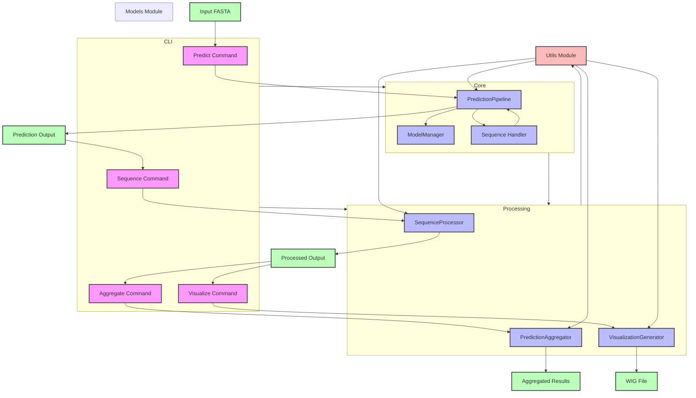

# AMR Predictor Architecture

This document provides a detailed overview of the AMR Predictor's architecture, including component relationships, data flow, and logic flow.

## Architecture Diagram

## Component Description

### Main Components

1. **CLI Interface**
   - Handles command-line interactions
   - Provides four main commands: predict, sequence, aggregate, and visualize
   - Manages argument parsing and command routing

2. **Core Module**
   - Contains the main prediction logic
   - Includes PredictionPipeline for orchestrating the prediction process
   - Manages model loading and inference
   - Handles sequence processing and splitting

3. **Processing Module**
   - Handles data transformation and analysis
   - Includes components for sequence processing, aggregation, and visualization
   - Manages data format conversions and file I/O

4. **Models Module**
   - Manages ML models and their configurations
   - Handles model loading and inference
   - Provides model-specific utilities

5. **Utils Module**
   - Provides shared functionality across components
   - Includes logging, progress tracking, and file handling utilities
   - Manages common data structures and helper functions

### Data Flow

1. **Prediction Pipeline**
   - Input: FASTA file containing genomic sequences
   - Process: Sequence loading, splitting, and model inference
   - Output: Prediction results in CSV/TSV format

2. **Sequence Processing**
   - Input: Prediction output file
   - Process: Sequence information extraction and processing
   - Output: Processed sequence data with metadata

3. **Aggregation**
   - Input: Processed sequence data
   - Process: Results aggregation across multiple models/files
   - Output: Aggregated statistics and classifications

4. **Visualization**
   - Input: Processed sequence data
   - Process: Conversion to visualization format
   - Output: WIG file for genome browser visualization

### Component Relationships

- CLI commands interface with Core and Processing modules
- Core module orchestrates the prediction process
- Processing module handles data transformation and analysis
- Utils module provides shared functionality across components
- Models module supports the prediction pipeline

## Key Features

1. **Sequence Processing**
   - Support for segmented sequence analysis
   - Flexible sequence splitting with overlap
   - Comprehensive sequence metadata extraction

2. **Aggregation Methods**
   - Any Resistance detection
   - Majority Voting classification
   - Probability Averaging
   - Method agreement analysis

3. **Visualization**
   - Genome browser compatible WIG format
   - Configurable step size
   - Support for segmented sequences

4. **Monitoring and Logging**
   - Comprehensive progress tracking
   - Detailed logging at multiple levels
   - Performance metrics collection 