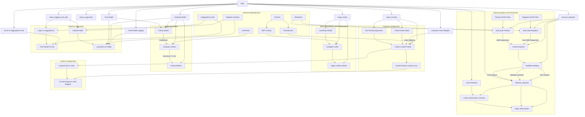

```mermaid
graph TD
    %% Main program flow
    MAIN[main] --> PARSE_ARGS[parse_arguments]
    MAIN --> SETUP_LOG[setup_logging_and_auth]
    MAIN --> PROCESS_DS[process_datasets]
    MAIN --> CALC_WEIGHTS[Calculate Class Weights]
    MAIN --> LOAD_TOK[Load Tokenizer]
    MAIN --> TOKENIZE_DS[tokenize_datasets]
    MAIN --> SETUP_MODEL[setup_model]
    MAIN --> SETUP_TRAIN[setup_training]
    MAIN --> TRAIN[Train Model]
    MAIN --> EVALUATE[Evaluate Model]
    MAIN --> PUSH_HUB[Push to HuggingFace Hub]
    MAIN --> FINISH_LOG[Finish W&B Logging]

    %% Data flow
    subgraph DataFlow[Data Acquisition and Processing]
        FASTA_POS[Positive FASTA Files]
        FASTA_NEG[Negative FASTA Files]
        LOAD_FASTA_POS[load_fasta Positive]
        LOAD_FASTA_NEG[load_fasta Negative]
        CREATE_DS[Create Datasets]
        SPLIT_DS[Stratified Splitting]
        GEN_TOK_FN[create_tokenization_function]
        APPLY_TOK[Apply Tokenization]
        
        FASTA_POS --> LOAD_FASTA_POS
        FASTA_NEG --> LOAD_FASTA_NEG
        LOAD_FASTA_POS --> |AMR Sequences| CREATE_DS
        LOAD_FASTA_NEG --> |Non-AMR Sequences| CREATE_DS
        CREATE_DS --> SPLIT_DS
        SPLIT_DS --> |Train Dataset| TOKENIZE_DS
        SPLIT_DS --> |Validation Dataset| TOKENIZE_DS
        SPLIT_DS --> |Test Dataset| TOKENIZE_DS
        LOAD_TOK --> GEN_TOK_FN
        GEN_TOK_FN --> APPLY_TOK
        TOKENIZE_DS --> APPLY_TOK
    end
    
    PROCESS_DS --> LOAD_FASTA_POS
    PROCESS_DS --> LOAD_FASTA_NEG
    PROCESS_DS --> CREATE_DS
    PROCESS_DS --> SPLIT_DS
    TOKENIZE_DS --> GEN_TOK_FN
    TOKENIZE_DS --> APPLY_TOK

    subgraph ModelSetup[Model Initialization and Configuration]
        BASE_MODEL[Load Base Model]
        LORA_CONFIG[Configure LoRA]
        APPLY_LORA[Apply LoRA to Model]
        
        BASE_MODEL --> LORA_CONFIG
        LORA_CONFIG --> APPLY_LORA
    end
    
    SETUP_MODEL --> BASE_MODEL
    SETUP_MODEL --> LORA_CONFIG
    SETUP_MODEL --> APPLY_LORA

    subgraph TrainingSetup[Training Configuration]
        CUSTOM_TRAINER[Create CustomTrainer]
        COMPUTE_LOSS[CustomTrainer.compute_loss]
        TRAIN_ARGS[Set Training Arguments]
        DATA_COLLATOR[Create DataCollator]
        
        CUSTOM_TRAINER --> COMPUTE_LOSS
        TRAIN_ARGS --> CUSTOM_TRAINER
        DATA_COLLATOR --> CUSTOM_TRAINER
    end
    
    CALC_WEIGHTS --> |Class Weights| CUSTOM_TRAINER
    SETUP_TRAIN --> CUSTOM_TRAINER
    SETUP_TRAIN --> TRAIN_ARGS
    SETUP_TRAIN --> DATA_COLLATOR
    
    subgraph Evaluation[Model Evaluation]
        COMP_METRICS[compute_metrics]
        PREDICT[Trainer.predict]
        EXTRACT_METRICS[Extract Metrics]
        
        PREDICT --> |Predictions| COMP_METRICS
        COMP_METRICS --> |Accuracy, F1, etc.| EXTRACT_METRICS
    end
    
    TRAIN --> PREDICT
    EVALUATE --> PREDICT
    EVALUATE --> COMP_METRICS
    EVALUATE --> EXTRACT_METRICS
    
    subgraph ExternalServices[External Integrations]
        HF_LOGIN[Login to HuggingFace]
        WANDB_INIT[Initialize W&B]
        PUSH_MODEL[Push Model to Hub]
        LOG_METRICS[Log Metrics to W&B]
        
        HF_LOGIN --> PUSH_MODEL
        WANDB_INIT --> LOG_METRICS
    end
    
    SETUP_LOG --> HF_LOGIN
    SETUP_LOG --> WANDB_INIT
    PUSH_HUB --> PUSH_MODEL
    TRAIN --> LOG_METRICS
    EVALUATE --> LOG_METRICS
    FINISH_LOG --> LOG_METRICS
    
    %% Key dependencies
    subgraph Dependencies[External Dependencies]
        PYTORCH[PyTorch]
        TRANSFORMERS[Transformers]
        PEFT[PEFT Library]
        HUGGINGFACE[HuggingFace Hub]
        WANDB[Weights & Biases]
        BIOPYTHON[BioPython]
        SKLEARN[scikit-learn]
        
        PYTORCH --> TRANSFORMERS
        PYTORCH --> PEFT
        TRANSFORMERS --> CUSTOM_TRAINER
        PEFT --> LORA_CONFIG
        HUGGINGFACE --> HF_LOGIN
        HUGGINGFACE --> PUSH_MODEL
        WANDB --> WANDB_INIT
        WANDB --> LOG_METRICS
        BIOPYTHON --> LOAD_FASTA_POS
        BIOPYTHON --> LOAD_FASTA_NEG
        SKLEARN --> COMP_METRICS
    end
    
    %% Custom class relationship
    subgraph CustomComponents[Custom Components]
        TRAINER_CLASS[CustomTrainer Class]
        WEIGHTED_LOSS[CrossEntropyLoss with Weights]
        
        TRAINER_CLASS --> WEIGHTED_LOSS
    end
    
    CUSTOM_TRAINER --> TRAINER_CLASS
    COMPUTE_LOSS --> WEIGHTED_LOSS
``` 
